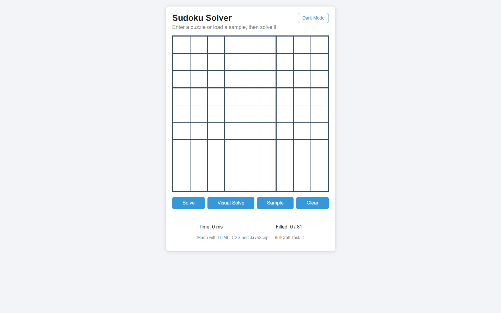

# Sudoku Solver

A simple Sudoku Solver web application built using HTML, CSS, and JavaScript.

This project was developed as **Task 3** of the **SkillCraft Technology Software Development Internship**.

The application allows users to enter Sudoku puzzles manually, load a sample puzzle, solve instantly using a backtracking algorithm, or watch the solving process step-by-step through Visual Solve mode.

## Live Demo

https://armaan0047.github.io/SCT_SD_3/

---

## Features

* Interactive 9x9 Sudoku grid
* Manual puzzle entry
* Solve puzzle instantly
* Visual Solve animation
* Sample puzzle loader
* Clear board functionality
* Invalid puzzle detection
* Unsolvable puzzle detection
* Success message after solving
* Solve time display
* Filled cells counter
* Dark mode toggle
* Responsive design for desktop and mobile devices

---

## Screenshots

### Main Interface


### Visual Solve Mode



---

## How to Run

No installation required.

Simply open:

`index.html`

in any modern web browser.

Project Structure:

```text
SCT_SD_3/
├── index.html
├── css/style.css
├── js/script.js
├── README.md
├── LICENSE
└── .gitignore
```

## Algorithm

The solver uses the classic Backtracking Algorithm:

1. Find the first empty cell.
2. Try digits 1–9.
3. Validate against row, column, and 3×3 box rules.
4. Move to the next empty cell.
5. If no valid number exists, backtrack and try another value.

Both Solve and Visual Solve use the same solving logic.

The Visual Solve feature records each placement and backtrack step, then replays those steps as an animation so users can understand how the algorithm works.

---

## Technologies Used

* HTML5
* CSS3
* JavaScript (Vanilla JS)

---

## Internship Information

Organization: SkillCraft Technology

Track: Software Development Internship

Task: SCT_SD_3 – Sudoku Solver

---

## Author

Developed by Armaan as part of the SkillCraft Technology Internship.
